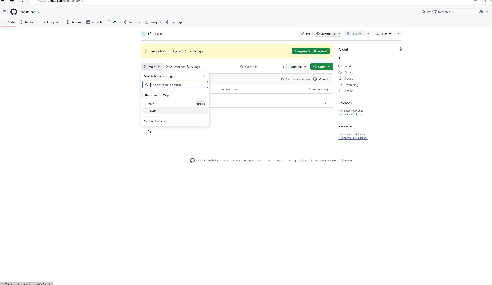
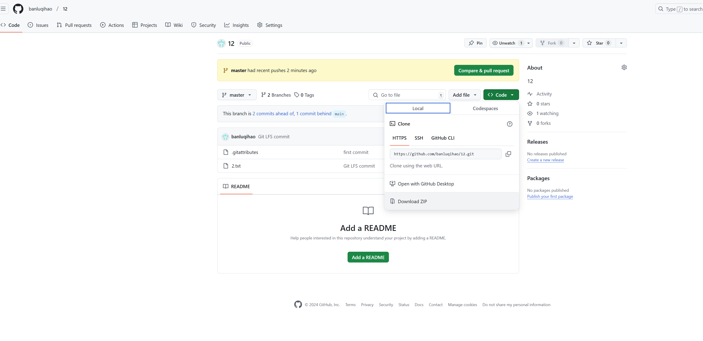
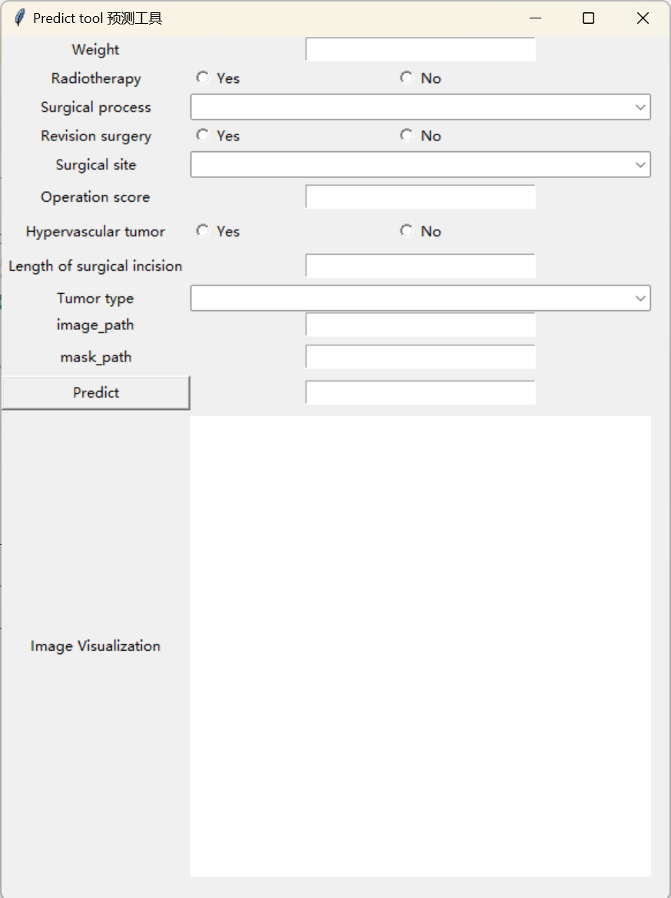
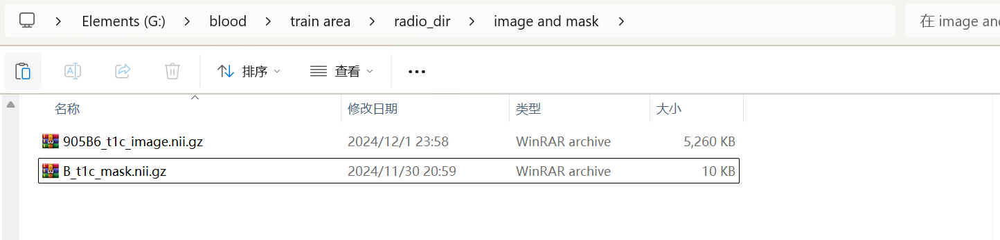
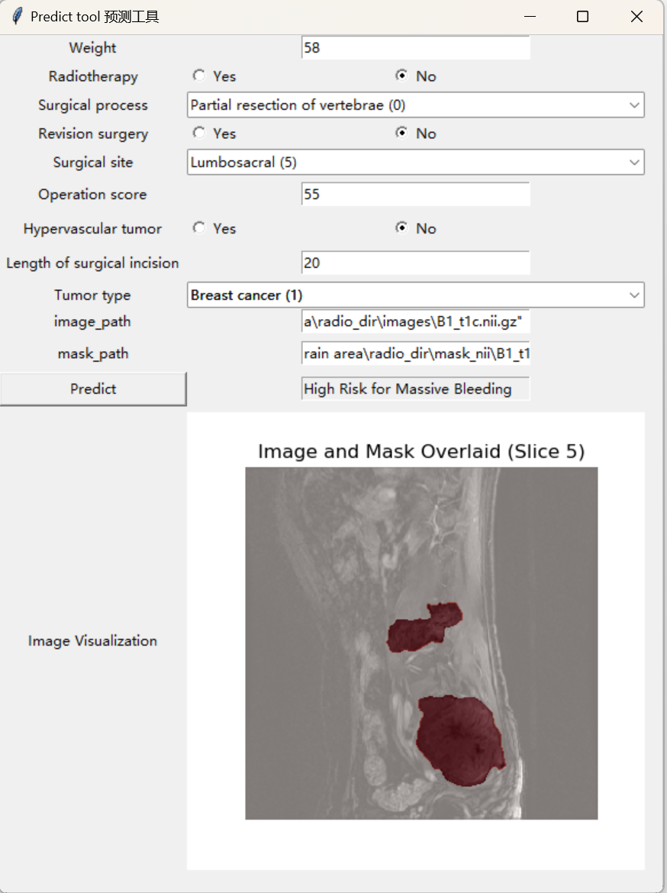

# A-predict-tool-for-spinal-metastases-surgery
A tool for predicting the risk of intraoperative massive bleeding in patients with spinal metastases. Please read the User guide after downloading, which will assist you in using it.
Instructions for use:
This tool is used to predict whether patients with spinal metastatic cancer will experience massive bleeding during surgery.
Open the ''master'', click Download ZIP and unzip it.

After unzipping the folder, click Start Up and the tool will run automatically.

Notes:
* ‘Image path’ and ‘mask path’ need to input the path of the corresponding image and mask, and end with nii.gz format!
* Please draw the mask on the image after 1*1*1 resampling before inputting! Not resampling will lead to inaccurate model feature extraction and subsequent model prediction of the image.
* You can choose to draw multiple sections on the mask, or only draw the largest section that you think contains the tumor area. After entering the path, the tool will automatically draw the pixels on each section and select the largest section for prediction.
After entering the image and its path, the tool will automatically perform N4 bias field correction and fixed bin width discretization, then extract features and input the model for prediction.

After entering clinical factors and imaging pathways, the selected maximum cross-section will be displayed and the prediction results will be given. High Risk for Massive Bleeding means that the model believes that the patient will have massive bleeding, while Low Risk for Massive Bleeding means that the model believes that the patient will not have massive bleeding. (Final example image)

